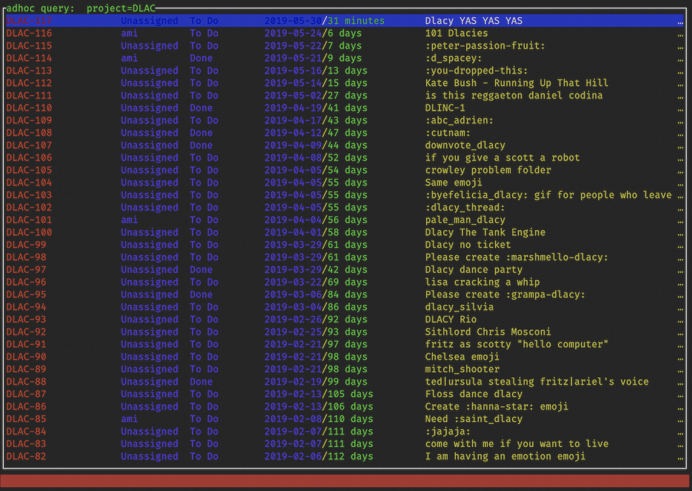

go-jira-ui
----------

go-jira-ui is an ncurses command line tool for accessing JIRA.

It is built around the excellent [go-jira](https://github.com/Netflix-Skunkworks/go-jira) and
[termui](https://github.com/gizak/termui) libraries.

It aims to be similar to familiar tools like vim, tig, and less.

In order to use this, you should configure an 'endpoint' as per the go-jira
documentation:

    $ cat ~/.jira.d/config.yml
    ---
    endpoint: https://jira.example.com/
    user: bob   # if not same as $USER

This should be all that's needed to get going.

### Installation

    # Make sure you have GOPATH and GOBIN set appropriately first:
    # eg:
    #   export GOPATH=$HOME/go
    #   export GOBIN=$GOPATH/bin
    #   mkdir -p $GOPATH
    #   export PATH=$PATH:$GOBIN
    go get -v github.com/mikepea/go-jira-ui/jira-ui

### Features

* Supply your own JQL queries to view
* Label view of a given query, to see categorisations easily
* Sorting of queries; supply your own custom sorts
* View tickets from the query
* Drill into sub/blocker/related/mentioned tickets in details view
* Show open tickets in an Epic.
* Basic compatibility with [go-jira](https://github.com/Netflix-Skunkworks/go-jira) commandline and options loading
* Label adding/removing
* Comment, watch, assign and take implemented via :-mode commands

At present, edit will exit after the update. This is a workaround
to an implementation issue, being tracked in [#8](https://github.com/mikepea/go-jira-ui/issues/8)

### Usage

`jira-ui` is intended to mirror the options of go-jira's `jira` tool, where
useful:

    jira-ui             # opens up in Query List page. Default interface.
    jira-ui ISSUE       # opens up Ticket Show page, with ISSUE loaded
    jira-ui ls -q JQL   # opens up Ticket List page, with results of JQL loaded.
    jira-ui -h          # help page

### Basic keys

Actions:

    <enter>      - select query/ticket
    r            - mark ticket for ranking (use naviation to change rank, <enter> to submit)
    L            - Label view (query results page only)
    E            - Edit ticket
    S            - Select sort order (query results page only)
    w            - Watch the selected ticket
    W            - Unwatch the selected ticket
    v            - Vote for the selected ticket
    V            - Remove vote on the selected ticket
    N            - Next ticket in results
    P            - Previous ticket in results
    h            - show help page

Commands (like vim/tig/less):

    :comment {single-line-comment} - add a short comment to ticket
    :label {labels}                - add labels to selected ticket
    :label add/remove {labels}     - add/remove labels to selected ticket
    :take                          - assign ticket to self
    :assign {user}                 - assign ticket to {user}
    :unassign                      - unassign ticket
    :watch [add/remove] [watcher]  - watch ticket (optionally as a different user)
    :vote                          - vote for the selected ticket
    :unvote                        - remove vote for the selected ticket
    :view {ticket}                 - display {ticket}
    :query {JQL}                   - display results of JQL
    :search|so {text}              - quick search for {text} in open tickets
    :search-all|sa {text}          - quick search for {text} in all tickets
    :spo {project} {text}          - quick search for {text} in open {project} tickets
    :spa {project} {text}          - quick search for {text} in all {project} tickets
    :help                          - show help page
    :<up>                          - select previous command
    :quit or :q                    - quit

Searching:

    /{regex}                       - search down
    ?{regex}                       - search up

Navigation:

    up/k         - previous line
    down/j       - next line
    C-f/<space>  - next page
    C-b          - previous page
    }            - next paragraph/section/fast-move
    {            - previous paragraph/section/fast-move
    n            - next search match
    g            - go to top of page
    G            - go to bottom of page
    q            - go back / quit
    C-c/Q        - quit

### Configuration

It is very much recommended to read the
[go-jira](https://github.com/Netflix-Skunkworks/go-jira) documentation,
particularly surrounding the .jira.d configuration directories. go-jira-ui uses
this same mechanism, so can be used to load per-project defaults. It also
leverages the templating engine, so you can customise the view of both the
query output (use 'jira_ui_list' template), and the issue 'view' template.

go-jira-ui reads its own  `jira-ui-config.yml` file in these jira.d
directories, as not to pollute the go-jira config. You can add additional
queries & sort orderings to the top-level Query page:

    $ cat ~/jira.d/jira-ui-config.yml:
    sorts:
      - name: "sort by vote count"
        jql:  "ORDER BY votes DESC"
    queries:
      - name: "alice assigned"
        jql:  "assignee = alice AND resolution = Unresolved"
      - name: "bob assigned"
        jql:  "assignee = bob AND resolution = Unresolved"
      - name: "unresolved must-do"
        jql:  "labels = 'must-do' AND resolution = Unresolved AND ( project = 'OPS' OR project = 'INFRA')"

Learning JQL is highly recommended, the Atlassian [Advanced
Searching](https://confluence.atlassian.com/jira/advanced-searching-179442050.html)
page is a good place to start.
